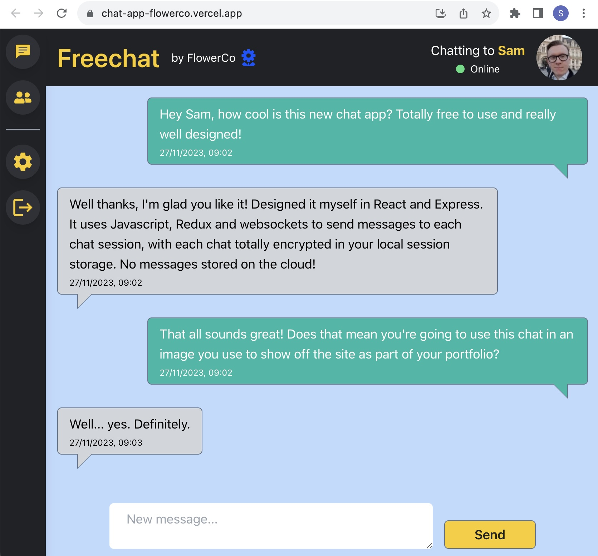
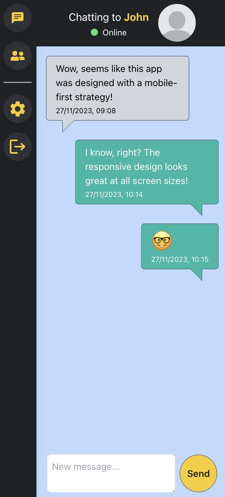
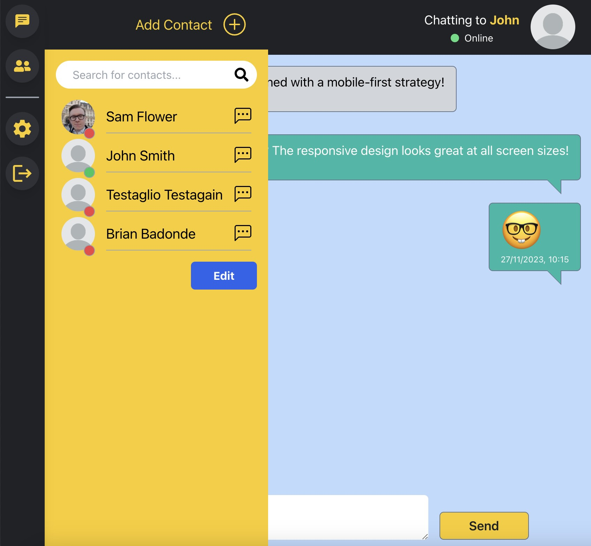

# [FreeChat](https://chat-app-flowerco.vercel.app/)

FreeChat lets you chat with friends easily online - no need for complex signup or installing a separate phone app. It is fully responsive for use on both mobile and desktop devices.

With FreeChat your messages are only stored locally, and encrypted for additional security.

The FreeChat app can be found at the following address, deployed in test mode using [Vercel and Railway](https://chat-app-flowerco.vercel.app/)

  
  
  

## Tech stack

FreeChat is a React application built in JavaScript using Tailwind CSS for front-end design.

State management is handled by Redux Toolkit and messages are sent via Socket.io connection.

The chat-app repository works in combination with the chat-app-backend repo. This includes an Express server connected to MongoDB for data storage. User image files are uploaded to Cloudinary for remote access.

## Getting started

After cloning Freechat to a local repo, the following environment settings are required:

REACT_APP_CLOUDINARY_CLOUD_NAME: The Cloudinary database name for remote upload of media files.

REACT_APP_CLOUDINARY_UPLOAD_PRESET: A string provided by Cloudinary representing the upload config options and authorization for the account.

REACT_APP_MESSAGE_ENCRYPTION_KEY: A text string of your choice to use as a key for local message ecryption

REACT_APP_HOSTNAME: This is an optional deployment variable to connect to a deployed backend server. If this is not provided the path to the back-end server will default to localhost/3002.
